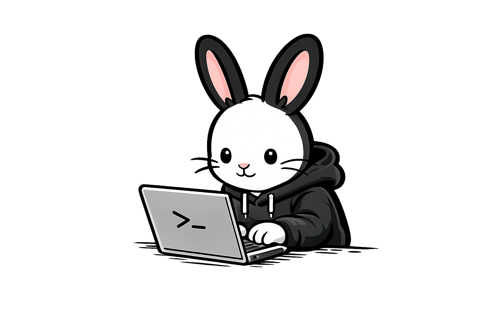

<h1 align="center">Warren</h1>

<p align="center">
  
</p>

<p align="center">
  <strong>Install any CLI tool unlimited times. Every instance is its own world.</strong>
</p>

<p align="center">
  <a href="https://crates.io/crates/warren-cli"></a>
  <a href="https://docs.rs/warren-cli"></a>
  <a href="https://github.com/swadhinbiswas/warren/blob/main/LICENSE.md"></a>
</p>

---

**Warren** is a production-grade, rootless, zero-daemon CLI runtime. It lets you install and run unlimited, completely isolated instances of any CLI or TUI application on your Linux machine. It also wraps desktop and GUI apps — so you can run the same app twice with different accounts.

Like a rabbit warren, it creates a network of isolated tunnels—each self-contained yet sharing the same ground. Fast, rootless, and invisible infrastructure.

## Why Warren?

Ever needed to log into two different GitHub accounts using the `gh` CLI? Or test a beta version of a tool without breaking your stable setup? Or maintain separate configurations for work and personal projects?

With Warren, you can:
```bash
warren dig gh --as gh-work
warren dig gh --as gh-personal

gh-work        # Logs into your company GitHub
gh-personal    # Logs into your personal GitHub
```
Both instances behave independently. They share the host machine but nothing else.

Need two Discords at once — one for work, one for home? Warren wraps
your already-installed apps (Flatpak, Snap, system packages, AppImages
via `.desktop` entries) without reinstalling anything, giving each alias
its own private login and data:

```bash
warren dig flatpak:com.discordapp.Discord --as discord-work
warren dig flatpak:com.discordapp.Discord --as discord-home

discord-work   # Logs into your work Discord
discord-home   # Logs into your personal Discord
```

Each instance appears in your app grid, keeps the host Wayland/DBus
session working, and stores only its private data — the host app binary
is reused, so wrapping costs almost no disk space.

### Non-Goals
Warren is **not** a container runtime (like Docker), a virtual machine, or a privilege escalation tool. 
It stays lightweight (single binary), rootless (no sudo ever), zero-daemon (no background processes), and incredibly fast (<50ms startup overhead).

## Features

- **Isolated Filesystems:** Each instance gets its own `home/`, `config/`, `cache/`, `data/`, and `tmp/` directories.
- **App Wrapping:** Run the same GUI app many times (`flatpak:`, `snap:`, `apt:`/`dnf:`/`pacman:`/…, `app:`, `desktop:`) with fully separate logins — rootless, zero-copy.
- **Desktop Integration:** GUI instances get their own `warren-<alias>.desktop` entry, keep host Wayland/DBus/audio working, and launch detached.
- **Installer Rewriting:** Automatically rewrites paths inside installation scripts on-the-fly to keep them contained.
- **Rootless by Design:** Will absolutely refuse to run as root.
- **Universal Shell Support:** Works seamlessly across Bash, Zsh, Fish, and Nushell.
- **Zero Overhead:** No daemons or containers. Just a thin, native bash launcher script.

## Installation

### Method 1: The One-Liner (Recommended)

Install directly from the raw GitHub link. No dependencies needed beyond
`curl` (and `cargo`, if a pre-built binary isn't available yet for your
architecture yet):

```bash
curl -fsSL https://raw.githubusercontent.com/swadhinbiswas/warren/main/install.sh | bash
```

The installer is smart about how it gets the binary:

1. It downloads the pre-built binary from the latest GitHub release when
   one exists for your architecture (`x86_64` or `aarch64`).
2. Otherwise it downloads the Warren source tree straight from GitHub and
   builds it with `cargo install`.
3. Either way it finishes by configuring your shell (`bash`, `zsh`, `fish`,
   or `nushell`) so `warren` is on your `$PATH`.

For more control, download the script first and pass options:

```bash
curl -fsSL https://raw.githubusercontent.com/swadhinbiswas/warren/main/install.sh -o install.sh
bash install.sh --from-source        # always build from source
WARREN_REF=v0.1.6 bash install.sh    # install a specific release/tag
```

### Method 2: Via Cargo (crates.io)

If you already have Rust installed, you can build and install Warren directly from crates.io:

```bash
cargo install warren-cli
warren shell install  # Sets up your PATH
```

## Quick Start

**1. Install a new instance from a remote script:**
```bash
warren dig "curl -fsSL https://opencode.ai/install | bash" --as opencode-work
```

**2. See what you've installed:**
```bash
$ warren ls

  ALIAS            APP         VERSION    KIND    CREATED
  opencode-work    opencode    0.4.2      cli     just now
  discord-work     discord     -          gui     just now
```

**3. Run your instance:**
```bash
opencode-work --version
# or 
warren run opencode-work -- --version
```

**4. Inspect an instance's isolated footprint:**
```bash
warren inspect opencode-work
```

## Desktop & GUI Apps

Warren wraps instead of reinstalling: the host application binary is
reused, and each alias gets a private `$HOME`/`$XDG_*` sandbox (plus its
own `.desktop` entry), so accounts never leak into each other.

```bash
# Flatpak (Flathub id or prefix both work)
warren dig com.discordapp.Discord --as discord-work
warren dig flatpak:org.mozilla.firefox --as firefox-dev

# Snap / system packages (wraps the installed binary — stays rootless)
warren dig snap:discord --as discord-home
warren dig apt:firefox --as firefox-work
warren dig pacman:code --as code-work

# Smart lookup: $PATH → .desktop entry → flatpak
warren dig app:discord --as discord-fun

# Any desktop entry by id, name, or file
warren dig desktop:discord --as discord-test

# Force GUI treatment (app-grid entry + detached run) or CLI treatment
warren dig apt:htop --as htop --no-gui
warren dig app:mytool --as mytool-gui --gui
```

`warren ls` shows a `KIND` column (`gui`/`cli`), `warren run <alias>`
detaches graphical apps automatically, and `warren rm` removes the
`.desktop` entry along with the instance.

## Workspace Sessions

Crashed, rebooted, or closed everything by accident? Warren can snapshot
your running desktop session and bring it back with one command:

```bash
warren session save                  # snapshot apps, terminals, workdirs
warren session restore               # reopen everything (latest snapshot)
warren session restore --dry-run     # preview the relaunch plan first
warren session ls                    # list saved snapshots
warren session rm <name>             # delete one snapshot
warren session prune                 # delete old snapshots, keep newest
```

Snapshots are tiny TOML files under `~/.warren/sessions/`. Every `save`
auto-deletes snapshots beyond your retention limit (default: keep the
last 5, configurable via `--keep` or `sessions.keep` in
`~/.warren/config.toml`), so they never bloat your disk. Tip: enable
your browser's "continue where you left off" setting so tabs come back
alongside the reopened windows.

## How it Works

Warren achieves total isolation without kernel namespaces or OverlayFS through three simple levers: 

1. **Intelligent Rewriting:** When you install a tool via a bash script, Warren intercepts it. It scans for hardcoded paths (like `/usr/local/bin` or `~/.config`) and rewrites them to point inside the instance's private directory (`~/.warren/instances/<alias>`).
2. **Environment Injection:** Warren generates a lightweight wrapper script in `~/.local/bin`. When you run your alias, this script forcibly overrides `$HOME`, `$XDG_CONFIG_HOME`, `$XDG_DATA_HOME`, and `$TMPDIR`. Graphical instances additionally keep the host display/session bus (`$DISPLAY`, `$WAYLAND_DISPLAY`, `$DBUS_SESSION_BUS_ADDRESS`, host `$XDG_RUNTIME_DIR`) so Wayland, notifications, and audio keep working.
3. **Execution:** The target application boots up, entirely unaware that its "home directory" is actually a sandbox inside `~/.warren/`.
4. **App Wrapping:** For Flatpak/Snap/system/desktop sources, there is no installer to rewrite — Warren resolves the host launch command once (`flatpak run …`, `/usr/bin/…`) and bakes it into the per-instance launcher. Same sandbox, zero copies.

## Command Reference

| Command | Description |
| :--- | :--- |
| `warren dig <source> --as <alias>` | Install a new isolated instance |
| `warren dig flatpak:<id> --as <alias>` | Wrap a Flatpak app (e.g. 2× Discord) |
| `warren dig app:<name> --as <alias>` | Wrap any installed app (smart lookup) |
| `warren dig <source> --as <alias> --gui/--no-gui` | Override GUI/CLI detection |
| `warren run <alias>` | Run an instance explicitly (detaches GUI apps) |
| `warren ls` | List all installed instances |
| `warren inspect <alias>` | View paths, version, and disk usage |
| `warren clone <src> <dest>` | Deep copy an instance |
| `warren export <alias>` | Export an instance to a portable `.tar.gz` archive |
| `warren import <archive>` | Import a previously exported instance |
| `warren update <alias>` | Re-run the installer (re-resolves wrapped apps, data untouched) |
| `warren rm <alias>` | Delete an instance and all its isolated data |
| `warren session save` | Snapshot your desktop session (apps, terminals, workdirs) |
| `warren session restore` | Reopen everything with one command |
| `warren session ls` / `rm` / `prune` | Manage saved session snapshots |
| `warren env` | Show warren's environment information |
| `warren shell install` | Add Warren to your terminal's PATH |
| `warren shell info` | Show detected shell and bin directory |

## Shell Support

Warren automatically detects your shell and configures your `$PATH`. It natively supports:
- **Bash** (`~/.bashrc` / `~/.bash_profile`)
- **Zsh** (`~/.zshrc`)
- **Fish** (`~/.config/fish/config.fish` via `fish_add_path`)
- **Nushell** (`env.nu` via `$env.PATH`)

## Requirements

- **Linux** (x86_64 or aarch64) — Warren refuses to run as root, so use
  your normal user account.
- For the one-liner installer: `curl` (plus `cargo` only when no
  pre-built binary exists yet for your architecture).
- Wrapped GUI/system apps must already be installed (Flatpak, Snap, or
  your distro package manager) — Warren reuses them, never reinstalls.

## Configuration

Optional settings live in `~/.warren/config.toml`:

```toml
[ui]
color = true
progress = true

[sessions]
keep = 5   # session snapshots retained; older ones auto-delete on save
```

## Color Output

Warren uses color automatically when stderr is a terminal. You can control
this with standard environment variables:

- `NO_COLOR=1` — disable all color output (always wins)
- `CLICOLOR_FORCE=1` — force color even when piping
- Config options `ui.color` and `ui.progress` in `~/.warren/config.toml`

## License

MIT License. See [LICENSE.md](LICENSE.md) for details.
